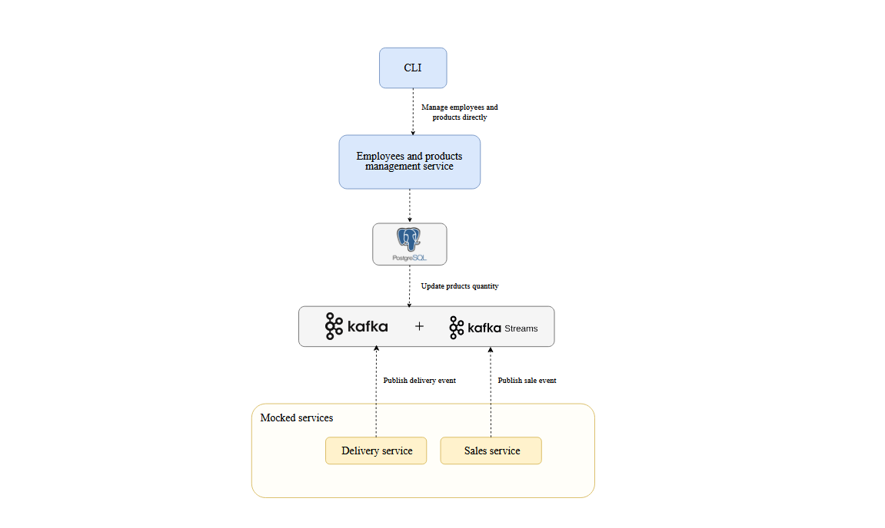
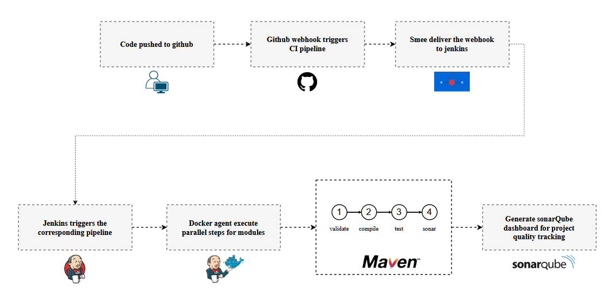

# Stock Management System

## Overview

The Stock Management System manages inventory through purchases (sales) and deliveries. It processes stock events using **Apache Kafka** and updates product quantities in real time via **Kafka Streams**. Events are stored in two separate PostgreSQL databases: one for historical events and another for current employee and product data.

The system includes basic **mocked sales** and **delivery services** to simulate event processing, with a **CLI** interface to manage employees and products.

## Features

- **Kafka Integration**: Stock events (sales and deliveries) are published to Kafka topics, processed via Kafka Streams, and used to update product quantities in PostgreSQL.

- **Two PostgreSQL Databases**:
    - **Historical Events Database**: Stores all stock transaction events.
    - **Employee and Product Database**: Stores employee and product data; product quantities are updated in real time based on Kafka events.

- **Mocked Sales and Delivery**: Sales and delivery services are implemented simply to simulate adding delivery and sale events.

- **CLI for Management**: Employees can manage products and check quantities using a command-line interface.

- **CI/CD with Jenkins**: GitHub webhooks trigger Jenkins to run a CI pipeline, automating the build and test process.

- **Code Quality with SonarQube**: Integrated with SonarQube for static code analysis.

## Technology Stack

- **Spring Boot** for backend development
- **Apache Kafka** for event-driven architecture
- **PostgreSQL** for storing stock data
- **Jenkins** for CI/CD automation
- **SonarQube** for code quality analysis
- **GitHub** for repository management

## Architecture 

## CI pipeline

